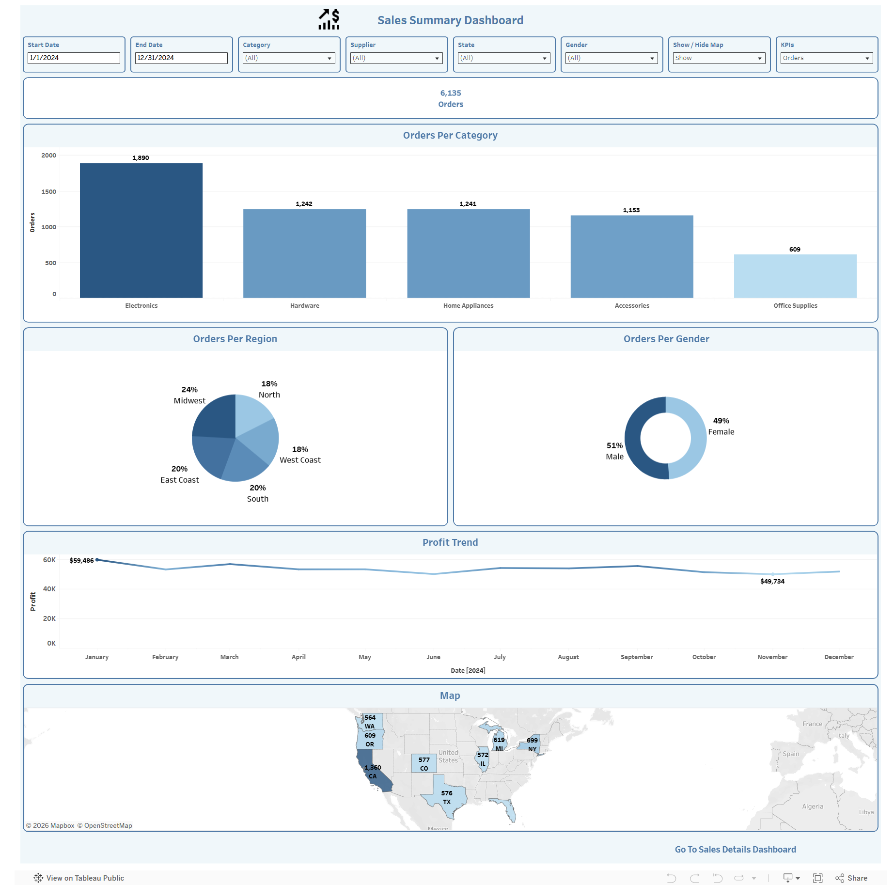
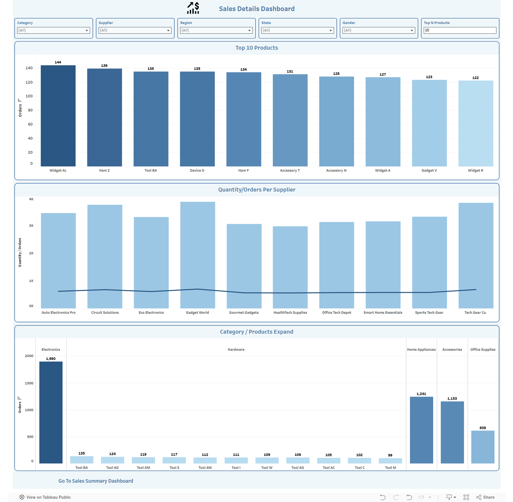

# 📊 Sales Performance Tableau Dashboards

> A project I built during my Power BI Development training at the Information Technology Institute (ITI) — two fully interactive Tableau dashboards designed to analyze sales performance from both a high-level overview and a granular, detailed perspective.

🔗 **[View Live Dashboards on Tableau Public](https://public.tableau.com/views/Final-Dashboards/SalesSummaryDashboard?:language=en-US&:sid=&:redirect=auth&:display_count=n&:origin=viz_share_link)**

---

## 🖼️ Dashboard Previews

### Dashboard 1: Sales Summary

### Dashboard 2: Sales Details

---

## 📌 Overview

This project goes beyond static reporting — it focuses on building **flexible, user-driven analytics solutions** that empower users to explore data the way they need. Both dashboards are fully **mobile-friendly**, so insights are accessible anytime, anywhere.

---

## 🗂️ Dashboard Breakdown

### Dashboard 1️⃣ — Sales Summary

A high-level view of overall sales performance, featuring:

- **Dynamic KPIs** that update based on user selection
- **Orders by Category** — quickly identify top-performing categories
- **Orders by Region & Gender** — understand the customer distribution
- **Profit Trend** — track performance over time across the full year
- **Interactive Map** with:
  - Show/Hide toggle for map visibility
  - Zoom action on click to focus on a selected location

### Dashboard 2️⃣ — Sales Details

A deep-dive into product and supplier performance, featuring:

- **Flexible Top N Products** analysis — users control how many top products to display via a dynamic parameter
- **Quantity & Orders per Supplier** — dual axis chart for side-by-side comparison of two measures
- **Expandable Category View** — drill into product-level details within each category

---

## ⚙️ Key Features & Techniques

| Feature | Description |
|---|---|
| **Dynamic Parameters** | Control Top N products, switch KPIs, show/hide map |
| **Interactive Filters** | Date range, Category, Supplier, Region, State, Gender |
| **Navigation Actions** | Seamless movement between dashboards |
| **Drill-Down & Highlight Actions** | Deeper exploration within charts |
| **Map Zoom Action** | Click a region on the map to zoom in |
| **Dual Axis Chart** | Combine and compare multiple measures in one view |
| **Mobile-Friendly Design** | Optimized layout for phone and tablet exploration |

---

